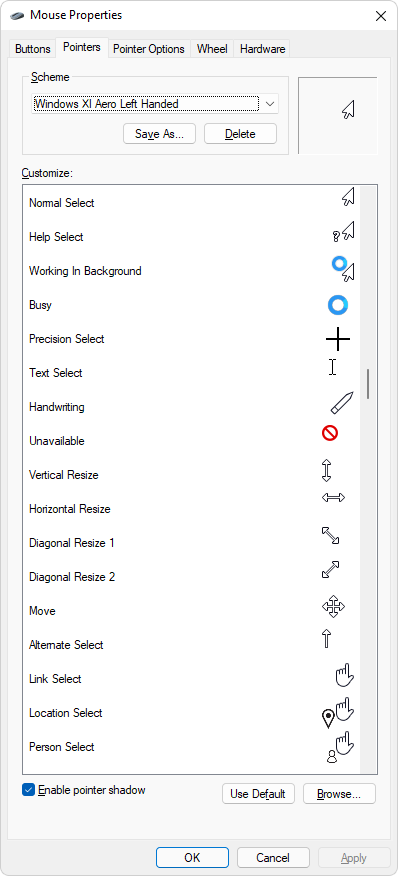

# Windows 11 Aero Cursor Schemes for Left-handed People

## Cursor Schemes

- Windows XI Aero Left Handed
- Windows XI Aero Left Handed (Large)
- Windows XI Aero Left Handed (Extra Large)

## Installation

- Clone the repository.

  ```sh
  git clone git@github.com:Microtribute/win11-aero-left-cursors.git
  ```

- Right click on the `INF` files and select *Install* from the context menu.
- Open up the *Windows Control Panel* and go to the *Mouse* settings.
- Switch to the *Pointers* tab.
- Choose your favorite scheme from the *Scheme* dropdown.
- Click OK.

## Supported Platforms

These cursor schemes can be installed on Microsoft Windows 7, 8, 10, and 11. Should be working on Windows XP and Vista but haven't been tested.

## Preview


